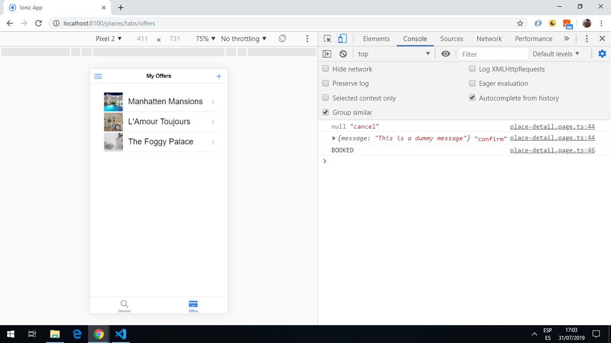

# Ionic Angular Project

App to create an Airbnb-style app, following Udemy Tutorial: [Ionic 4 - Build iOS, Android & Web Apps with Ionic & Angular](https://www.udemy.com/ionic-2-the-practical-guide-to-building-ios-android-apps/), using the [Ionic 5 framework](https://ionicframework.com/docs).
Code taken from course.

## Table of contents

* [General info](#general-info)
* [Screenshots](#screenshots)
* [Technologies](#technologies)
* [Setup](#setup)
* [Features](#features)
* [Status](#status)
* [Inspiration](#inspiration)
* [Contact](#contact)

## General info

* App to view and book places to stay. All places listed on the 'discover.page' and clicking on an item navigates to a place detail page using the place id in the browser.
* Places are displayed under 2 list option: 'ALL PLACES' and 'BOOKABLE PLACES'. The first place is displayed using an ion-card, the remaining places are displayed using a list with a thumbnail image. There is code to prevent the user from being able to book their own places, using a userId matching function.
* Places can be booked, listed and cancelled.
* New places can be added. The location of the new place is chosen using google maps and is displayed in the template using data-binding. A photo can be taken to add to the new Place description. If there is no camera then there is a file upload button to save a jpeg image.
* Burger side panel added with links to the discover places listings, your bookings and a logout button.
* Bottom menu with 2 links to 'Discover' (default page upon loading) and 'Offers' that lists all the places available.

## [RxJS operators](http://reactivex.io/documentation/observable.html)

**switchMap** for http requests that emit just one value and for long-lived streams for Firebase real-time database and authentication. They do not need to be unsubscribed as they complete after emission. **switch:** because the result observable has switched from emitting the values of the first inner observable, to emitting the values of the newly created inner (derived) observable. The previous inner observable is cancelled and the new observable is subscribed. **map:** because what is being mapped is the emitted source value, that is getting mapped to an observable using the mapping function passed to switchMap. (The alternative operator is mergeMap).

**of** used with a single value for an 'emit once and complete' stream.

**take** tba

**tap** tba

## Screenshots




## Technologies

* [Ionic v5.0.0](https://ionicframework.com/)
* [Angular v8.1.2](https://angular.io/)
* [Ionic/angular v 4.7.1](https://ionicframework.com/)
* [RxJS v6.5.1](https://angular.io/guide/rx-library)
* [Google Firebase](https://firebase.google.com)
* [Google Maps Javascript API](https://developers.google.com/maps/documentation/javascript/tutorial)
* [Capacitor v1.1.1](https://capacitor.ionicframework.com/)

## Setup

* To start the server on _localhost://8100_ type: `ionic serve`
* To generate normal www build file: `ionic build`
* Build for Android app: `ionic capacitor run android`

## Code Examples (taken from Udemy course with my comments added)

* extract from `map.modal.component.ts` - function to show location using google Maps API.

```typescript
private getGoogleMaps(): Promise<any> {
  const win = window as any;
  const googleModule = win.google;

  // check if google maps loaded already, if so go to google maps module
  if (googleModule && googleModule.maps) {
    return Promise.resolve(googleModule.maps);
  }

  // show google maps window as a DOM child script
  return new Promise((resolve, reject) => {
    const script = document.createElement('script');
    script.src = 'https://maps.googleapis.com/maps/api/js?key=' + environment.googleMapsAPIKey;
    script.async = true;
    script.defer = true;
    document.body.appendChild(script);

    // script listener is an anonymous arrow function
    script.onload = () => {
      const loadedGoogleModule = win.google;
      if (loadedGoogleModule && loadedGoogleModule.maps) {
        resolve(loadedGoogleModule.maps);
      } else {
        reject ('Google Maps SDK not available');
      }
    };
  });
 }
```

## Features

* Authorization module using Angular Routing with the Angular [canLoad auth guard interface](https://angular.io/api/router/CanLoad) to prevent access to pages if user is not logged in.
* [Theme variables.scss](https://ionicframework.com/docs/theming/css-variables) file used to create a global color theme using the [Ionic color palette](https://ionicframework.com/docs/theming/color-generator) (note colors were in rgb not #hex as shown in the Ionic tutorial).
* [Ionic datetime picker interface](https://ionicframework.com/docs/api/datetime) used to select booking dates. Alternative is a random dates option.
* [RxJS](https://angular.io/guide/rx-library) reactive programming used to manage state.
* Error handling added
* [Firebase backend database](https://firebase.google.com) used to store place and booking data. Images are stored in the same database.
* Bookings can be cancelled from booking.page.
* Place details can be edited (as long as user id matches) using a neat button that slides from the right.
* [Google Maps Javascript API](https://developers.google.com/maps/documentation/javascript/tutorial) map-modal added to new-offer page. Clicking on 'SELECT LOCATION' will open Google Maps at a fixed location. Address of place extracted from Google Maps data and stored in Places database.
* [Capacitor Geolocation API](https://capacitor.ionicframework.com/docs/apis/geolocation) used to provide current location.
* [Capacitor Camera API](https://capacitor.ionicframework.com/docs/apis/camera) used to provide camera functionality.
* [Firebase Auth API](https://firebase.google.com/docs/reference/rest/auth) used to control access to app.
* [Cordova Local Storage](https://cordova.apache.org/docs/en/latest/cordova/storage/storage.html#localstorage) to save user user authentication token so a refresh etc. does not lose a user's settings.
* [Google Cloud Storage](https://www.npmjs.com/package/@google-cloud/storage) used for storage of image data.
* Auth tokens on the backend.

## Status & To-do list

* Status: issue with auth token means user is logged out immediately. New database used which is currently empty.
* To-do: complete course

## Inspiration

[Acadamind Udemy Course: Ionic 4 - Build iOS, Android & Web Apps with Ionic & Angular](https://www.udemy.com/ionic-2-the-practical-guide-to-building-ios-android-apps/)

## Contact

Repo created by [ABateman](https://www.andrewbateman.org) - feel free to contact me!
