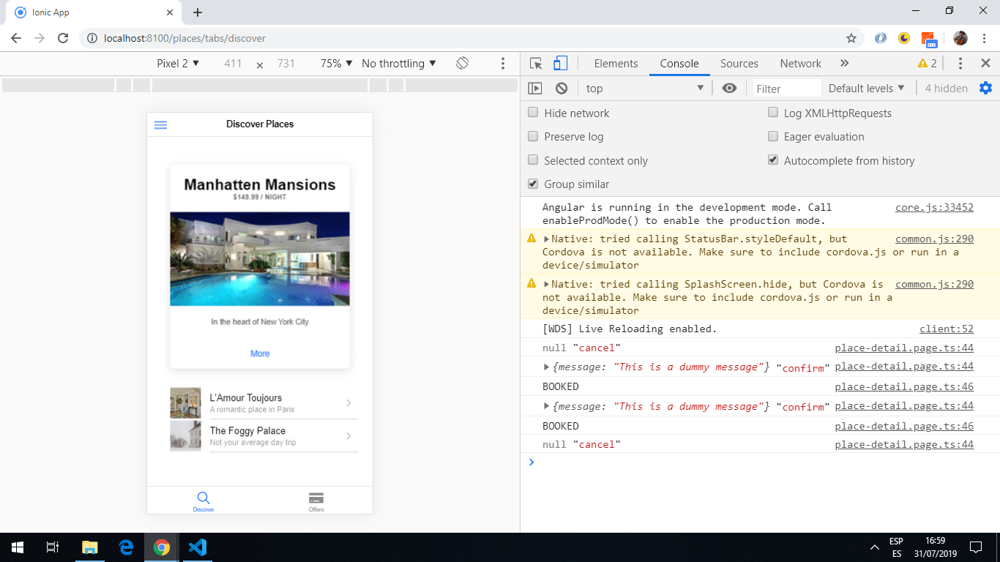
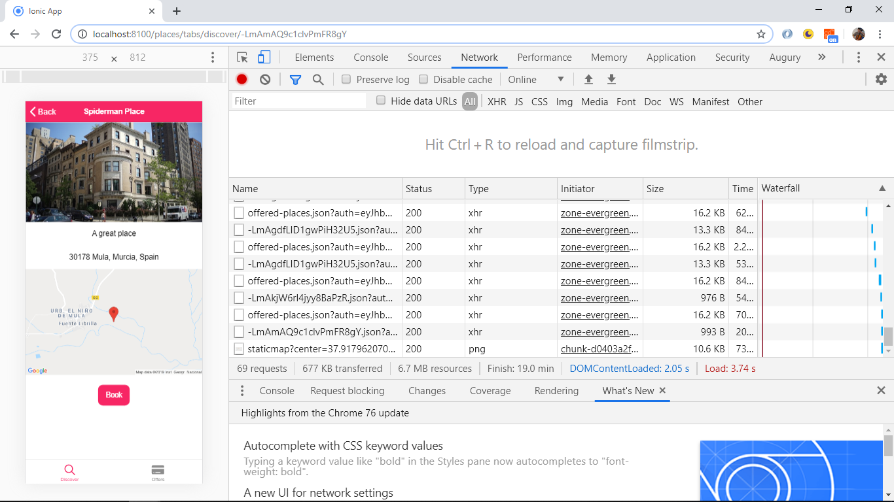
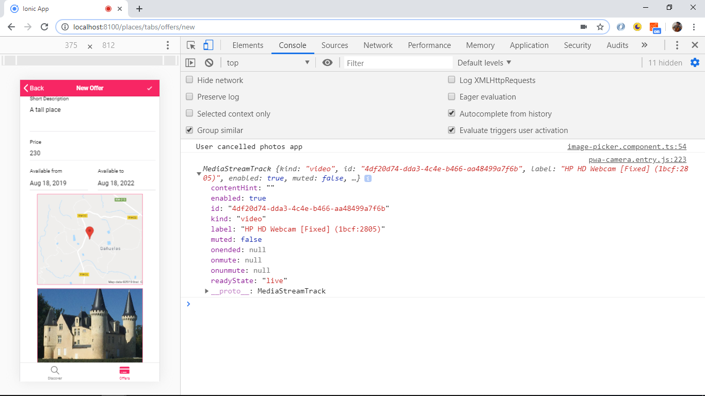
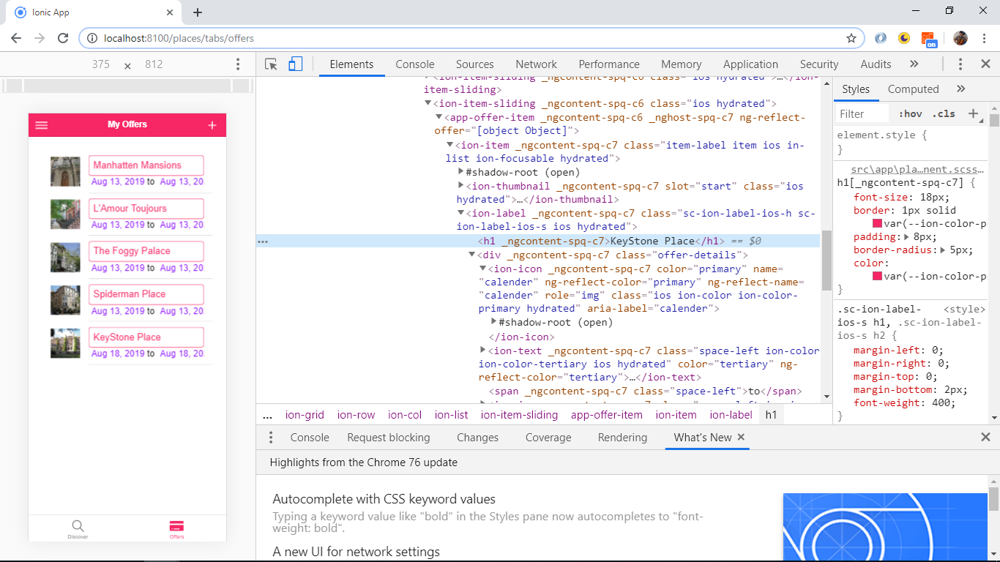
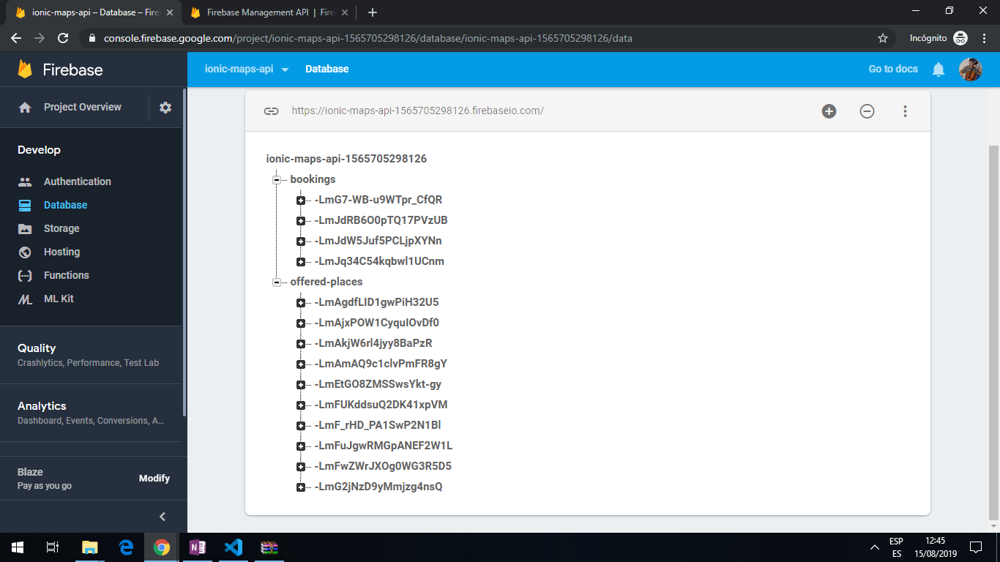

# :zap: Ionic Angular Project

App to create Airbnb-style property listings with pages to make bookings and update property details. Code taken from Udemy Tutorial: [Ionic 4 - Build iOS, Android & Web Apps with Ionic & Angular](https://www.udemy.com/ionic-2-the-practical-guide-to-building-ios-android-apps/), using the [Ionic 5 framework](https://ionicframework.com/docs).

## :page_facing_up:   Table of contents

* [:zap: Ionic Angular Project](#zap-ionic-angular-project)
  * [:page_facing_up:   Table of contents](#page_facing_up-table-of-contents)
  * [:books: General info](#books-general-info)
  * [RxJS operators](#rxjs-operators)
  * [:books: Ionic Controllers Used](#books-ionic-controllers-used)
  * [:books: Observables](#books-observables)
  * [:books: Array Operators](#books-array-operators)
  * [:camera: Screenshots](#camera-screenshots)
  * [:signal_strength: Technologies](#signal_strength-technologies)
  * [:floppy_disk: Setup](#floppy_disk-setup)
  * [:computer: Code Examples (taken from Udemy course with my comments added)](#computer-code-examples-taken-from-udemy-course-with-my-comments-added)
  * [:cool: Features](#cool-features)
  * [:clipboard: Status & To-do list](#clipboard-status--to-do-list)
  * [:clap: Inspiration](#clap-inspiration)
  * [:envelope: Contact](#envelope-contact)

## :books: General info

* App to view and book places to stay. All places listed on the 'discover.page' and clicking on an item navigate to a place detail page using the place id in the browser.
* Places are displayed under 2 list option: 'ALL PLACES' and 'BOOKABLE PLACES'. The first place is displayed using an ion-card, the remaining places are displayed using a list with a thumbnail image. There is code to prevent the user from being able to book their own places, using a userId matching function to show/hide the booking button.
* Places can be booked, listed and cancelled.
* New places can be added as 'Offers'. The location of the new place is chosen using the Google Maps API and is displayed in the template using data-binding. A photo can be taken to add to the new Place description. If there is no camera then there is a file upload button to save a jpeg image.The Firestore Function
* Burger side panel added with links to the discover places listings, your bookings and a logout button.
* Bottom menu with 2 links to 'Discover' (default page upon loading) and 'Offers' that lists all the places available.

## [RxJS operators](http://reactivex.io/documentation/observable.html)

* **general** all operators return observables. You have to subscribe to observables.
* **switchMap** for http requests that emit just one value and for long-lived streams for Firebase real-time database and authentication. They do not need to be unsubscribed as they complete after emission. **switch:** because the result observable has switched from emitting the values of the first inner observable, to emitting the values of the newly created inner (derived) observable. The previous inner observable is cancelled and the new observable is subscribed. **map:** because what is being mapped is the emitted source value, that is getting mapped to an observable using the mapping function passed to switchMap. (The alternative operator is mergeMap).
* **of** used with a single value for an 'emit once and complete' stream.
* **take** emits only the first n values from an observable (e.g. take(1) emits only the first 2 values )
* **tap** used to perform side effects. Every data value is received from the source, an action is taken on a part of the data then the data passeed on unchanged.
* **map** transforms things. It passes each source value through a transformation function then outputs the results, e.g map(x => 10*x).
* **pipe** composes operators. Creates a pipeline of small reusable operators like map and filter.
* **from** converts a mix of other objects and data types into Observables

## :books: Ionic Controllers Used

* [Alert Controller](https://ionicframework.com/docs/api/alert) alert appears on top of app contents.
* [Loading Controller](https://ionicframework.com/docs/api/loading) overlay used to display activity and block user input. Loading indicators can be created, including spinners.

## :books: Observables

* An [observable](https://rxjs-dev.firebaseapp.com/guide/observable) is created using 'new Observable'. It is subscribed to using an Observer and executed to deliver next / error / complete notices to the Observer, before the execution is disposed of. Subscribers should be wrapped in try/catch blocks.
* a [BehaviourSubject](http://reactivex.io/rxjs/manual/overview.html#behaviorsubject) is a subject that requires an initial value and emits its current value to subscribers.

## :books: Array Operators

* [Array.push()](https://developer.mozilla.org/en-US/docs/Web/JavaScript/Reference/Global_Objects/Array/push) adds one or more elements to the end of an array and returns the new aray length.

## :camera: Screenshots







## :signal_strength: Technologies

* [Ionic v5](https://ionicframework.com/)
* [Angular v10](https://angular.io/)
* [Ionic/angular v5](https://ionicframework.com/)
* [RxJS v6](https://angular.io/guide/rx-library)
* [Google Firebase](https://firebase.google.com)
* [Google Maps Javascript API](https://developers.google.com/maps/documentation/javascript/tutorial)
* [Capacitor v2](https://capacitor.ionicframework.com/)
* [Ionic PWA Elements](https://www.npmjs.com/package/@ionic/pwa-elements)

## :floppy_disk: Setup

* Add Google maps and firebase API keys to environment.ts
* To start the server on _localhost://8100_ type: `ionic serve`
* To generate normal www build file: `ionic build`
* Build for Android app: `ionic capacitor run android`

## :computer: Code Examples (taken from Udemy course with my comments added)

* extract from `map.modal.component.ts` - function to show location using google Maps API.

```typescript
private getGoogleMaps(): Promise<any> {
  const win = window as any;
  const googleModule = win.google;

  // check if google maps loaded already, if so go to google maps module
  if (googleModule && googleModule.maps) {
    return Promise.resolve(googleModule.maps);
  }

  // show google maps window as a DOM child script
  return new Promise((resolve, reject) => {
    const script = document.createElement('script');
    script.src = 'https://maps.googleapis.com/maps/api/js?key=' + environment.googleMapsAPIKey;
    script.async = true;
    script.defer = true;
    document.body.appendChild(script);

    // script listener is an anonymous arrow function
    script.onload = () => {
      const loadedGoogleModule = win.google;
      if (loadedGoogleModule && loadedGoogleModule.maps) {
        resolve(loadedGoogleModule.maps);
      } else {
        reject ('Google Maps SDK not available');
      }
    };
  });
 }
```

* Firebase database setup: `".indexOn": ["userId"]` added to allow ordering by userId in `booking.service.ts`

```json
{
  "rules": {
    ".read": true,
    ".write": true,
      "bookings": {
        ".indexOn": ["userId"]
      }
  }
}

```

## :cool: Features

* Authorization module using Angular Routing with the Angular [canLoad auth guard interface](https://angular.io/api/router/CanLoad) to prevent access to pages if user is not logged in.
* [Theme variables.scss](https://ionicframework.com/docs/theming/css-variables) file used to create a global color theme using the [Ionic color palette](https://ionicframework.com/docs/theming/color-generator) (note colors were in rgb not #hex as shown in the Ionic tutorial).
* [Ionic datetime picker interface](https://ionicframework.com/docs/api/datetime) used to select booking dates. Alternative is a random dates option.
* [RxJS](https://angular.io/guide/rx-library) reactive programming used to manage state.
* Error handling added
* [Firebase backend database](https://firebase.google.com) used to store place and booking data. Images are stored in the same database.
* Bookings can be cancelled from booking.page.
* Bookings can be made and new places added to offers page. If a different user is logged in they cannot book their own places (the booking button does not show) - which is correct.
* Camera images now show.
* Place details can be edited (as long as user id matches) using a neat button that slides from the right.
* [Google Maps Javascript API](https://developers.google.com/maps/documentation/javascript/tutorial) map-modal added to new-offer page. Clicking on 'SELECT LOCATION' will open Google Maps at a fixed location. Address of place extracted from Google Maps data and stored in Places database.
* [Capacitor Geolocation API](https://capacitor.ionicframework.com/docs/apis/geolocation) used to provide current location.
* [Capacitor Camera API](https://capacitor.ionicframework.com/docs/apis/camera) used to provide camera functionality.
* [Fapacitor Local Storage](https://capacitor.ionicframework.com/docs/apis/storage/) API provides a key-value store for simple data. Used to save user authentication token so a refresh etc. does not lose a user's settings.
* [Google Cloud Storage](https://www.npmjs.com/package/@google-cloud/storage) used for storage of image data.
* Auth tokens on the backend.

## :clipboard: Status & To-do list

* Status: working. Updated to latest Ionic & Angular versions.
* To-do: Bookable place list is the same as the 'All Places' list - bookable places should not include the logged in users' places. 'My Offers' includes everyones places.

## :clap: Inspiration

[Acadamind Udemy Course: Ionic 4 - Build iOS, Android & Web Apps with Ionic & Angular](https://www.udemy.com/ionic-2-the-practical-guide-to-building-ios-android-apps/)

## :envelope: Contact

Repo created by [ABateman](https://www.andrewbateman.org) - feel free to contact me!
