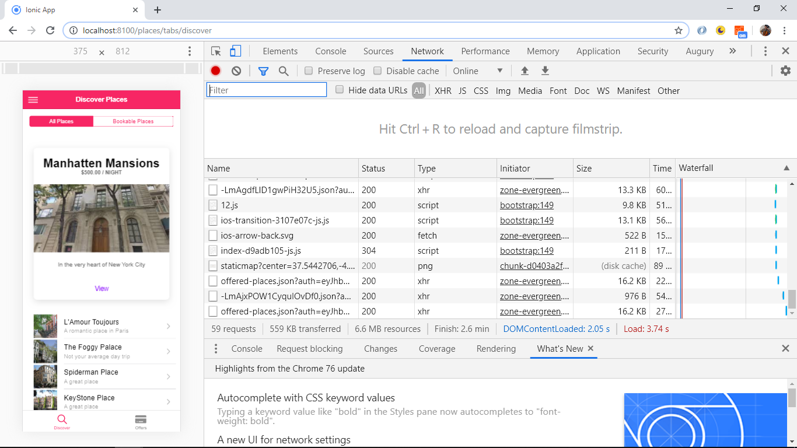

# Ionic Angular Project

App to create an Airbnb-style app, following Udemy Tutorial: [Ionic 4 - Build iOS, Android & Web Apps with Ionic & Angular](https://www.udemy.com/ionic-2-the-practical-guide-to-building-ios-android-apps/), using the [Ionic 5 framework](https://ionicframework.com/docs).

## Table of contents

* [General info](#general-info)
* [Screenshots](#screenshots)
* [Technologies](#technologies)
* [Setup](#setup)
* [Features](#features)
* [Status](#status)
* [Inspiration](#inspiration)
* [Contact](#contact)

## General info

* App to view and book places to stay. All places listed on the 'discover.page' and clicking on an item navigates to a place detail page using the place id in the browser.

* Places are displayed under 2 list option: 'ALL PLACES' and 'BOOKABLE PLACES'. The first place is displayed using an ion-card, the remaining places are displayed using a list with a thumbnail image. There is code to prevent the user from being able to book their own places, using a userId matching function.

* Places can be booked, listed and cancelled.

* Burger side panel added with links to the discover places listings, your bookings and a logout button.

* Bottom menu with 2 links to 'Discover' (default page upon loading) and 'Offers' that lists all the places available. At the moment these lists are the same.

## Screenshots

## Technologies

* [Ionic v5.0.0](https://ionicframework.com/)
* [Angular v8.1.2](https://angular.io/)
* [Ionic/angular v 4.7.1](https://ionicframework.com/)
* [RxJS](https://angular.io/guide/rx-library)

## Setup

* To start the server on _localhost://8100_ type: 'ionic serve'
* Build: tba

## Code Examples

* tba

## Features

* Authorization module using Angular Routing with the Angular [canLoad auth guard interface](https://angular.io/api/router/CanLoad) to prevent access to pages if user is not logged in.
* [Theme variables.scss](https://ionicframework.com/docs/theming/css-variables) file used to create a global color theme using the [Ionic color palette](https://ionicframework.com/docs/theming/color-generator) (note colors were in rgb not #hex as shown in the Ionic tutorial).
* [Ionic datetime picker interface](https://ionicframework.com/docs/api/datetime) used to select booking dates. Alternative is a random dates option.
* [RxJS](https://angular.io/guide/rx-library) reactive programming used to manage state.
* Error handling added
* Firebase backend database used to store place and booking data.

## Status & To-do list

* Status: Working but missing functionality.
* To-do: complete course

## Inspiration

[Acadamind Udemy Course: Ionic 4 - Build iOS, Android & Web Apps with Ionic & Angular](https://www.udemy.com/ionic-2-the-practical-guide-to-building-ios-android-apps/)

## Contact

Repo created by [ABateman](https://www.andrewbateman.org) - feel free to contact me!
